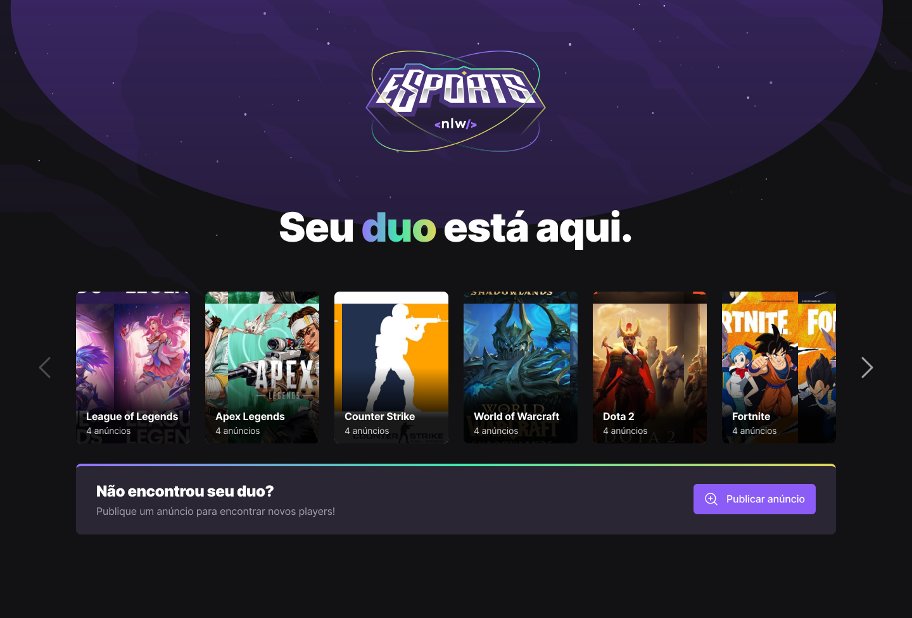

<h1 align="center">
    
    <br />
    <br />
    
    Find Your Duo
</h1>

<p align="center">
  <a href="#-tecnologias">Tecnologias</a>&nbsp;&nbsp;&nbsp;|&nbsp;&nbsp;&nbsp;
  <a href="#-projeto">Projeto</a>&nbsp;&nbsp;&nbsp;|&nbsp;&nbsp;&nbsp;
  <a href="#-layout">Layout</a>&nbsp;&nbsp;&nbsp;|&nbsp;&nbsp;&nbsp;
  <a href="#-licença">Licença</a>
</p>

<p align="center">
  
  
</p>

<br>

<p align="center">
  
  
</p>

<br>

## 🚀 Tecnologias

Esse projeto foi desenvolvido com as seguintes tecnologias:

- [React](https://reactjs.org/)
- [TypeScript](https://www.typescriptlang.org/)
- [Tailwind CSS](https://tailwindcss.com/)

<br>

## 💻 Projeto

A versão web do Find Your Duo permite que os jogadores criem anúncios, divididos por jogo, para que os outros jogadores possam se conectar, através do Discord.

<br>

## Como executar?

Para iniciar o cliente web local, execute os seguintes comandos no terminal:

```
$ npm install
$ npm run dev
```

<br>

## 🔖 Layout

Você pode visualizar o layout do projeto através desse [link](https://www.figma.com/file/9Azdqg7liIqt8mhCcvrlWZ/NLW-eSports-(Community)?node-id=459%3A1846).

<br>

## 📝 Licença

Esse projeto está sob a licença MIT. Veja o arquivo [LICENSE](LICENSE.md) para mais detalhes.

<br>

---

Projeto idealizado por Rocketseat ([Participe da comunidade!](https://discordapp.com/invite/gCRAFhc))